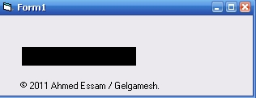



## Desktop IP Viewer

### Description

So, What's that "DESKTOP IP VIEWER" Thing?!

This desktop application will display your External (Not Local) IP.

Means, your PC ip on the internet.

Anyway, I didn't see (or may be i didn't search enough) about an application that do so.

So, i started to write this simple application.

It's only 1 line.

Yup, Only 1 Line.

No more talking, and it's the time to start working.

Rate if you like it. Comment if you wanna ask or complain about something.
 
### More Info
 

             |
---                |---
**Submitted On**   |2012-01-04 16:10:02
**By**             |[Gelgamesh](https://github.com/Planet-Source-Code/PSCIndex/blob/master/ByAuthor/gelgamesh.md)
**Level**          |Advanced
**User Rating**    |4.0 (12 globes from 3 users)
**Compatibility**  |VB 5\.0, VB 6\.0
**Category**       |[Internet/ HTML](https://github.com/Planet-Source-Code/PSCIndex/blob/master/ByCategory/internet-html__1-34.md)
**World**          |[Visual Basic](https://github.com/Planet-Source-Code/PSCIndex/blob/master/ByWorld/visual-basic.md)
**Archive File**   |[Desktop\_IP221758142012\.zip](https://github.com/Planet-Source-Code/gelgamesh-desktop-ip-viewer__1-74234/archive/master.zip)

